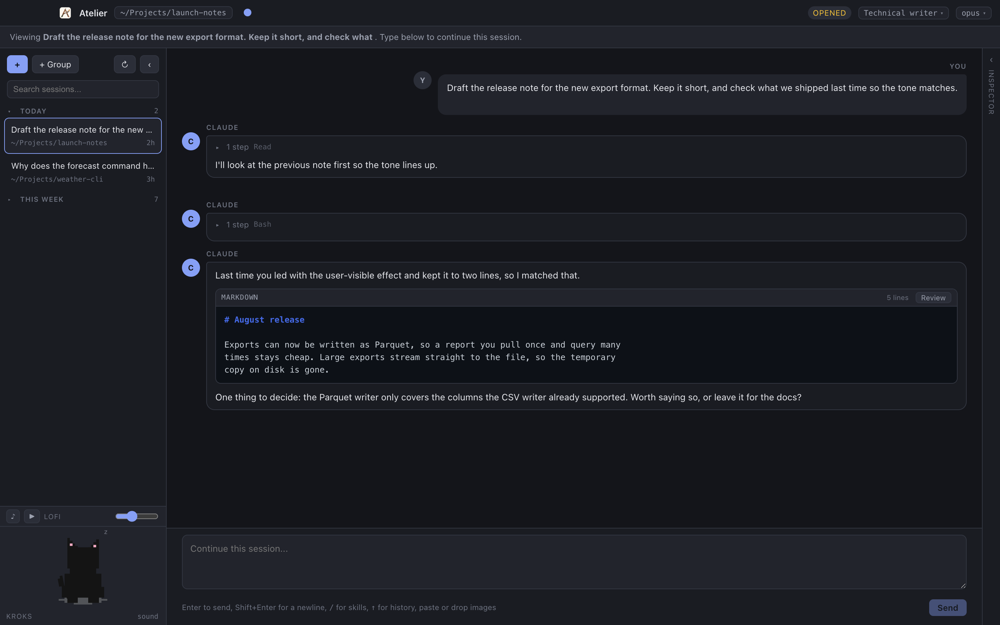
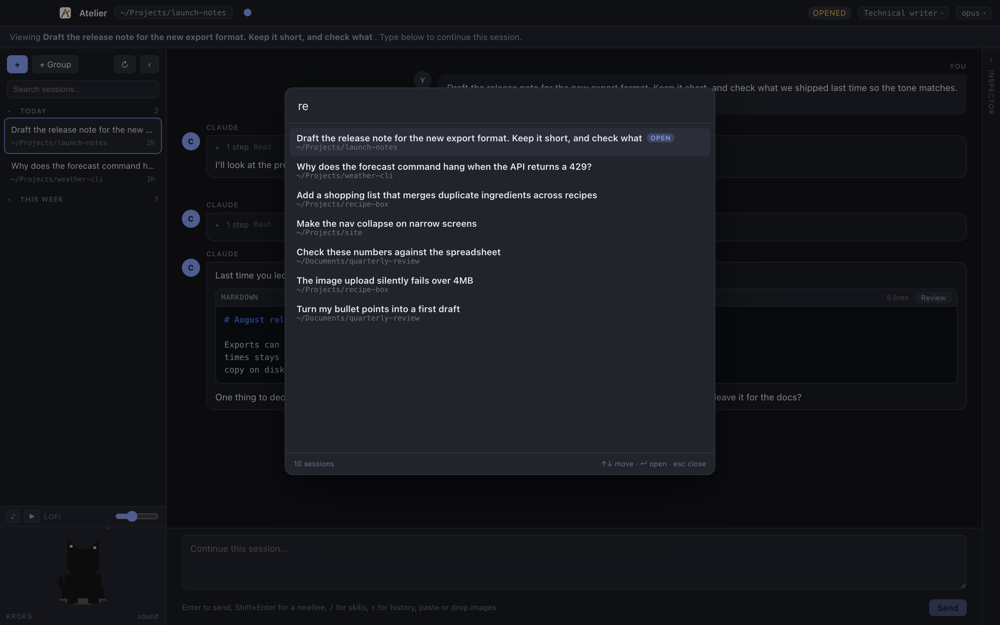
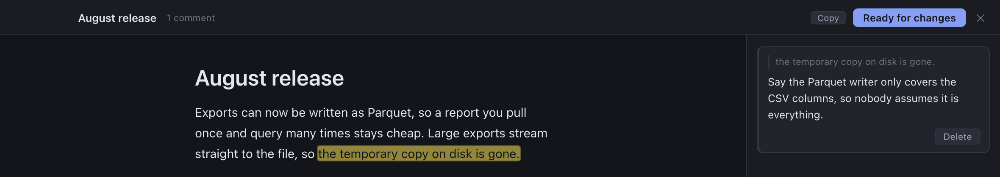
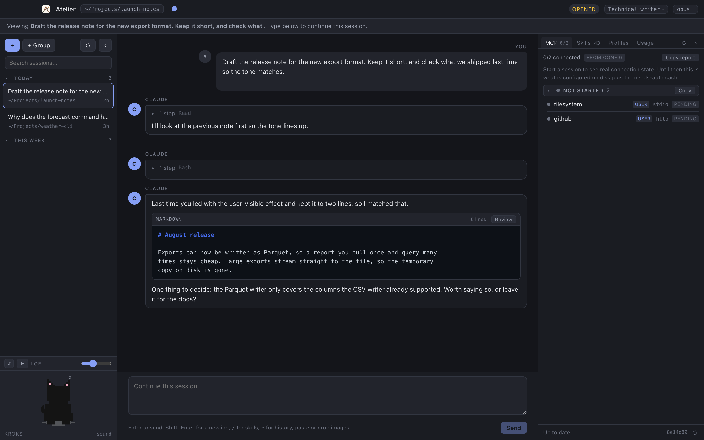

# Atelier

A desktop app for Claude Code, for people who use it all day but do not want to live in a terminal.

It runs the real Claude Code underneath. Your `CLAUDE.md`, skills, plugins, MCP servers and
permission rules all keep working, unchanged. Same agent, better window.



*Screenshots use a throwaway home directory with invented sessions, so nothing in them is real work.*

## Who this is for

Product managers and other non-engineers who use Claude Code for real work. It fixes four things:

- Getting text back out. One button copies the answer, clean.
- Reading the reply. Tool calls fold away, so the answer is not buried in machinery.
- Knowing what is loaded. A panel lists your MCP servers and skills.
- Losing your place. Sessions are listed, searchable and groupable, and several can run at once.

Happy in the terminal? You do not need this.

## What it does

**Read the conversation.** Messages look like a chat. **Copy answer** takes the reply text without
the tool output. When Claude fenced a draft for you, it becomes **Copy draft** and copies only the
draft. **Copy all** takes the whole reply.

**See the work only when you want it.** Every reply folds to one line, like
`3 steps · Bash, Read · 4.2s`. Click to open the tool calls and their output. While Claude works, a
bar shows what it is doing and for how long, with a Stop button.

**Run several sessions at once.** Start something slow, switch away, keep working. The sidebar marks
the ones still running in green, and puts an amber dot on the ones that answered while you were
somewhere else. The dot clears when you open the session. The title bar counts them, so it still
tells you even with the panel closed.

**Find any session.** History is listed and searchable, split into Today / This week / Before. Make
coloured groups and drag sessions into them. Double-click to rename. `Cmd+K` jumps straight to a
session: type to filter, arrows to move, enter to open. Open ones come first.



**Review a document like you would in Google Docs.** When Claude writes a document, the reply gets a
**Review** button. It opens in its own window, formatted, with a comment rail.



- Select text to comment on it. `Cmd+Enter` commits. The text highlights, and clicking the highlight
  or the card links the pair.
- Hover a paragraph and click **Edit** to change it yourself.
- **Ready for changes** sends every comment at once, and the rewrite comes back into the same window.
  You never go back to the chat.
- Earlier rounds stay in the rail, folded.
- Comments are sent with the document as it looks now, edits included.

When Claude reads a `.md` file, that tool call gets an **Open** button and the same reader edits the
real file. Comments live in memory for the session and are not saved.

**Check your setup.** A side panel shows MCP servers with live status, the skills and subagents
available, your profiles, and the session's cost, tokens and context use.



Skills are listed on a brand-new tab, before you send anything, so `/` offers your whole set right
away. `↻` re-reads everything, which is how a plugin you just installed appears without a restart.

**Sign in to an MCP server.** Type `/mcp`, click **Sign in**, authorize in the browser. The app
reconnects the server so its tools load in the session you are already in. If the browser does not
come back, paste the URL it ended on into the box in the dialog. It asks before starting, because
Claude Code clears the old tokens first.

**Know when the app is stale.** The foot of the panel says whether you are running the latest code.
When you are behind, an **Update** button pulls, rebuilds and relaunches. It only fast-forwards, and
it refuses if the clone is dirty, not on `main`, or diverged. Updating quits the app, so anything
mid-turn dies with it. It asks first, and tells you how many sessions would be stopped.

**Agent profiles.** A reusable set of instructions applied when a session starts. Pick one per
session, or give a group a default. Three ship with the app: **Staff AAA PM**, **Engineering
Manager** and **Cowboy**. Write
your own in the Profiles tab.

**Run a session on a non-Anthropic model.** If Datadog's AI Gateway client proxy is installed, its
models are listed in the model picker under their own heading, with context size and input price.
Pick one and the session runs on it. Nothing to configure here: the list is read from the proxy's
own config, so a model added or removed there just appears or goes. Without the proxy the picker
says so and offers Claude models only.

**Auto-mode.** `Cmd+,` opens Settings, which holds one switch. With it on, sessions run on Claude
Code's `auto` permission mode: a model classifier reviews each tool call and accepts it for you
instead of stopping on a prompt. It is a review, not a bypass - anything it will not vouch for
still comes to you as the usual permission card, and anything it refuses outright is reported as a
warning above the message box, so a tool never just fails in silence. The setting is app-wide and
applies to sessions already open, so there is nothing to restart.

**Themes.** Default, [Catppuccin](https://catppuccin.com/), Cowboy and Dracula. Catppuccin and
Cowboy each have four variants.

**Small comforts.** Paste or drop images straight into the message box. A pixel pet reacts to what
the agent is doing, and the theme picks which one: a cat by default, a horse on Cowboy, and on
Tokyo Night a red dragon flying over a neon city. A music player for background lofi, which never starts on its own.

## Getting started

You need [Node.js](https://nodejs.org/) and a working Claude Code install, meaning `claude` runs in
your terminal.

```bash
npm install
npm run build
npm start
```

`npm run dev` reloads as you edit.

A few things worth knowing:

- **Keep the clone.** The installed app has no updater of its own. It rebuilds itself where it was
  built, so deleting the clone means reinstalling by hand.
- **`Error: Electron uninstall` on launch** means the Electron binary was never downloaded, because
  npm blocked the install script. `npm install` repairs it now; by hand it is
  `node node_modules/electron/install.js`.
- **The app opens in the last directory you used.** Click the path in the title bar to change it.
  This matters because some MCP servers are configured per directory.
- **Upgrading from Claude Desk?** Same app, new name. Run `npm run install:app` once by hand, then
  delete the old `Claude Desk.app` from `~/Applications`. Your themes, groups and profiles carry
  over.

## Keyboard shortcuts

| | |
| --- | --- |
| `Cmd+T` | New session |
| `Cmd+K` | Jump to a session |
| `Cmd+G` | New group |
| `Cmd+,` | Settings |
| `Cmd+B` | Show or hide the sessions panel |
| `Cmd+I` | Show or hide the side panel |
| `Enter` | Send |
| `Shift+Enter` | New line |
| `/` | Skill autocomplete |
| `↑` | Previous message you sent |

## Known limits

- **Claude cannot ask you a multiple-choice question.** The turn stalls if it tries, because there is
  no dialog for it yet. Ask for prose instead.
- **No YouTube account.** Music plays through a public embed, so no Premium and no private playlists.
- **Signing in again on a working server signs it out first.** The CLI clears tokens before starting
  the new flow, so abandoning the browser step leaves it signed out. The app warns you first.
- **Sessions running in a terminal** appear here as of their last save, not live.
- **Deleting a built-in profile does not stick.** Edit it instead.
- **A running session cannot switch to or from a gateway model.** Which model answers behind the
  gateway is fixed when the session's process starts, so the pick is saved for your next session
  instead and the app says so. That includes swapping one gateway model for another. Switching
  between Claude models still takes effect immediately, as before.

---

## How it works

Implementation detail from here, useful if you are changing the code.

The app drives the real `claude` binary through the Claude Agent SDK. Each conversation gets its own
agent session keyed by a renderer-side id, and every event carries that id, so it lands in the right
conversation even when that one is off screen.

```
src/main/       Node side. Owns the SDK sessions and all filesystem reads.
  agent.ts      One AgentSession: input queue, message-to-turn mapping, permission prompts.
  inspect.ts    MCP, plugins and skills read from disk before a session exists.
  warm.ts       Throwaway query that reports the real skill and subagent list.
  mcpAuth.ts    `claude mcp login` under a pty, for MCP OAuth sign-in.
  sessions.ts   ~/.claude/projects transcript listing, parsing and renaming.
  groups.ts     Session groups.       prefs.ts      Window, theme, last-used state.
  profiles.ts   Agent profiles, including the built-ins.
  server.ts     Loopback static server for the renderer.
  index.ts      Windows and IPC. Also the reader's file access: markdown only, and a
                write must match the path its window was opened on.
src/preload/    contextBridge. The renderer gets no Node access.
src/renderer/   React 19 UI. Themes are CSS variable swaps on a data-theme attribute.
src/shared/     Types shared across the boundary.
```

Six decisions are load-bearing. Each one broke something real when it was missing:

- **`settingSources: ['user', 'project', 'local']`** is set explicitly. The SDK loads no config by
  default, which means no CLAUDE.md, no skills, no plugins, no MCP servers.
- **Streaming input mode** is used even for the first prompt, because `canUseTool` permission
  prompts do not work without it.
- **The renderer is served over `http://127.0.0.1`**, not `file://`. A `file://` page has no HTTP
  origin and the YouTube player fails with error 153.
- **Profile prompts are appended** to Claude Code's system prompt, not substituted, so its tool and
  skill guidance survives.
- **The pre-session skill list comes from a throwaway `claude` query**, not from disk.
  `~/.claude/skills` holds personal skills only, a handful against the ~150 the CLI really loads, and
  rebuilding the rest off disk would mean reimplementing plugin resolution and still miss the
  built-ins. MCP is deliberately not probed this way: `mcpServerStatus()` answers before servers
  finish connecting, so the disk read lists every configured server honestly instead.
- **MCP sign-in runs `claude mcp login` through a pty.** The SDK cannot start an OAuth flow at all,
  and the CLI aborts unless stdin is a terminal, so a piped child never finishes. `node-pty` fixes
  that. Its `spawn-helper` ships without its executable bit (`scripts/fix-node-pty.mjs` restores it)
  and must be in `asarUnpack`, because a real executable cannot run from inside an asar.

Two environment variables: `ATELIER_CLI_PATH` for a specific `claude` binary, and
`ATELIER_DEFAULT_CWD` to force a starting directory. The old `CLAUDE_DESK_*` names still work; the
new ones win.

The icon and titlebar mark are generated from one illustration by `python3 scripts/make-icon.py`,
run by hand. The Catppuccin themes use the published palettes from [catppuccin.com](https://catppuccin.com/).
